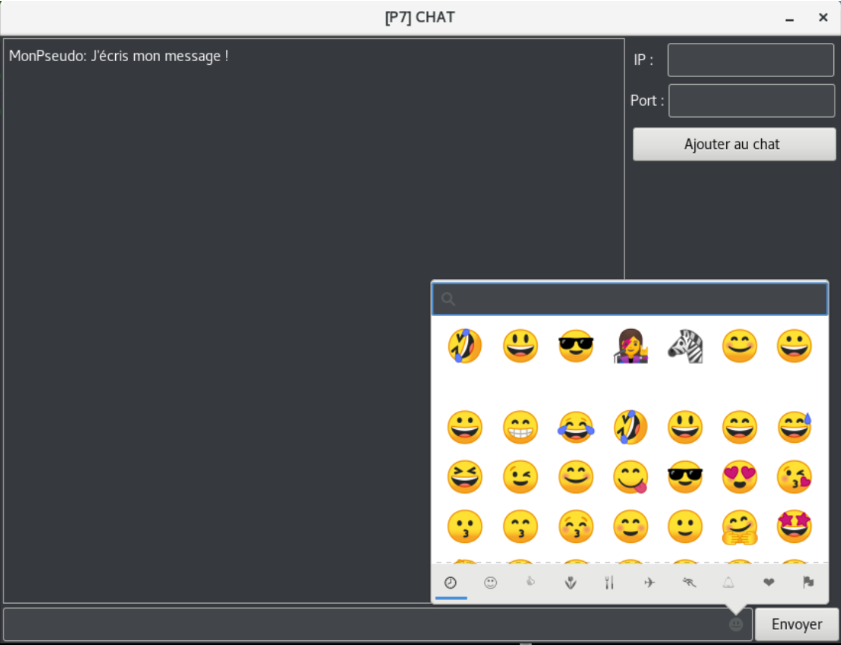

# Messagerie instantanée en C

## Installation et utilisation 

[ Pour plus d'information voir le poly "RAPPORT_BOZMAN_ALDAKAR.pdf" ]

### Installation des paquets pour l’interface graphique
Avant toute chose, il est nécessaire, afin de faire fonctionner notre programme de télécharger quelques bibliothèques :
- $ sudo apt-get install libgtk-3-dev
- $ sudo apt-get install fonts-noto-color-emoji1.

### Compilation
Pour compiler notre programme, on se place dans le dossier BOZMAN_ALDAKAR_RESEAU/ puis on lance la commande
- $ make
puis pour supprimer les binaires, on peut utiliser la commande :
- $ make fclean

### Exécution
Il existe deux versions de notre chat : une version avec un affichage graphique et une version avec un affichage terminal,
pour lancer la version terminal il suffit d’exécuter la commande :
- $ ./main ’mon-numéro-de-port’ ’mon-pseudo’
où ’mon-numéro-de-port’ est remplacé par le numéro de port sur lequel on veut que notre serveur écoute et ’mon-pseudo’ est
remplacé par le pseudo de notre choix, on peut également décider de ne pas choisir de pseudo et on aura alors par défaut le pseudo "Snow".
Par exemple :
- $ ./main 1215 MonPseudo
- $ ./main 1215
Pour l’affichage avec une interface graphique il suffit de faire :
- $ ./main
sans mettre d’arguments supplémentaires.

## Images

## Contributeurs

- Rodican Bozman
- Omar Aldakar

